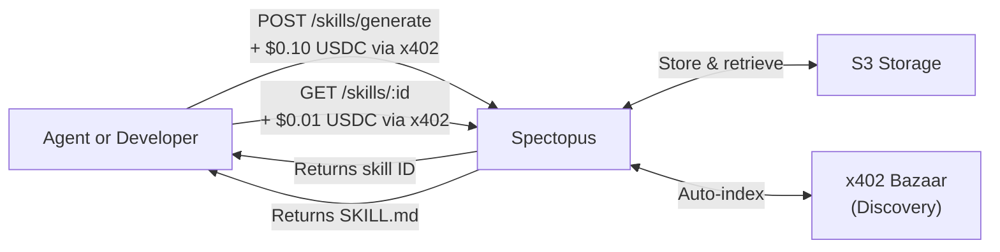
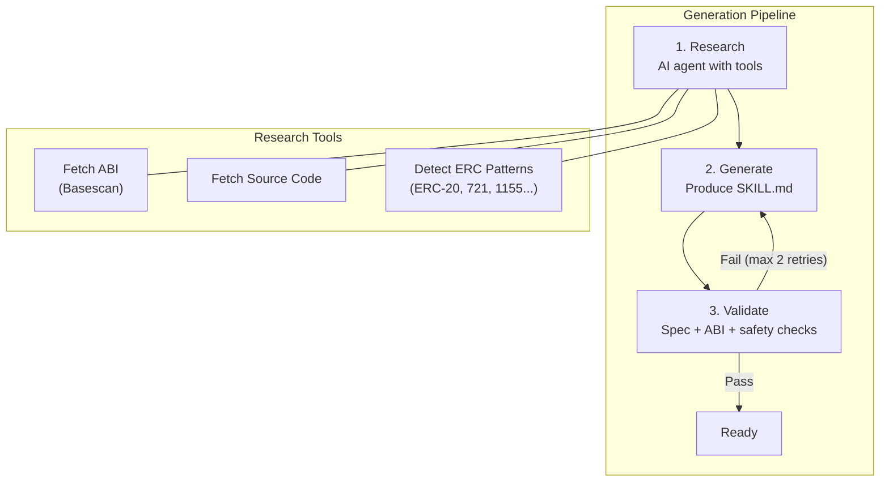
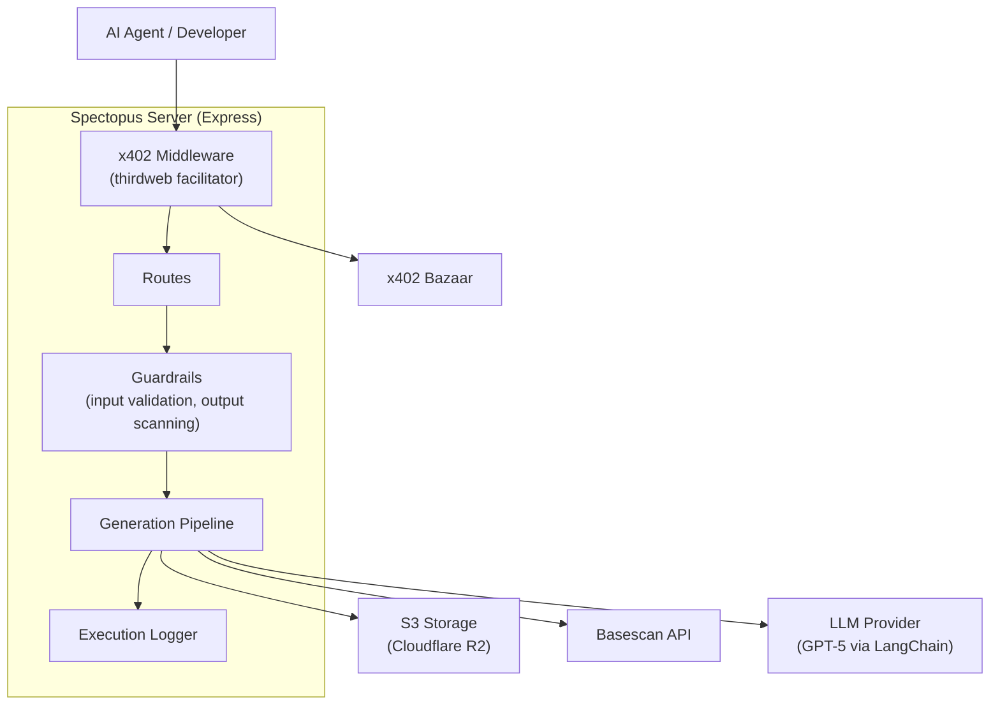

# Spectopus


**AI-powered skill generator for smart contracts.** Give it a contract address, get back a ready-to-use [Agent Skill](https://agentskills.io) — a portable SKILL.md file any AI agent can consume. Pay per use via [x402](https://x402.org), no accounts needed.

Built for [The Synthesis](https://synthesis.md) hackathon (Theme: Agents that trust) on Base Mainnet.

## The Problem

AI agents interacting with smart contracts today either hallucinate function signatures (wasting gas), burn context tokens parsing raw ABIs, or simply give up. There's no reliable way to go from a contract address to a working, structured skill an agent can use.

An agent *could* generate skills itself — but it lacks the specialized tools, domain knowledge, and validation pipeline to do it reliably. It's cheaper and faster to pay $0.10 to a specialist agent than to spend tokens and gas figuring it out locally.

## The Solution

Spectopus is an autonomous agent service that researches any smart contract and produces a high-quality Agent Skill — complete with typed function signatures, usage examples, gotchas, and safety warnings. Skills follow an open standard, so there's zero lock-in.



## How It Works

The generation pipeline is a fully autonomous AI agent loop — no human in the loop.



**Research** — An AI agent uses block explorer APIs to fetch the ABI, source code, and detect ERC patterns (ERC-20, 721, 1155, etc.)

**Generate** — An LLM produces a SKILL.md following the Agent Skills spec, with viem code examples

**Validate** — Cross-checks generated functions against the real ABI, runs spec validation, and scans for safety issues. Failures trigger a retry with feedback

## Vision: Beyond Smart Contracts

The PoC targets smart contracts on Base, but the architecture is niche-agnostic. The same research-generate-validate pipeline can produce skills for REST APIs, CLI tools, SDKs, or any domain where an expert agent with the right tools outperforms a generalist doing it from scratch. This makes Spectopus a foundation for a **generic skills marketplace** — with built-in x402 incentivization for builders (humans or AI agents) to contribute and monetize skills.

## Key Strengths

| | |
|---|---|
| **Autonomous end-to-end** | No human intervention — research, generate, validate, deliver |
| **Open standard output** | Agent Skills spec (SKILL.md) — portable, no vendor lock-in |
| **x402 native payments** | Pay-per-use with USDC, no API keys or accounts |
| **Discoverable** | Auto-indexed on x402 Bazaar for agent-to-agent discovery |
| **Safety-first** | Input validation, output scanning, fail-closed validation, prompt injection defenses |
| **Structured logging** | Full execution logs for every pipeline run (tool calls, LLM I/O, decisions) |
| **ERC-8004 identity** | On-chain agent identity on Base Mainnet |

## Architecture



## Tech Stack

- **Runtime:** Node.js (ES modules) + Express
- **Payments:** x402 via thirdweb facilitator — USDC on Base Mainnet
- **AI:** LangChain + LangGraph (ReAct agent) with OpenAI provider (GPT-5)
- **Storage:** S3-compatible (Cloudflare R2)
- **Block Explorer:** Basescan API for ABI/source code
- **Identity:** ERC-8004 on Base Mainnet

## Design Decisions

**S3 storage, no database.** For the PoC, skills are stored as JSON objects in S3-compatible storage (Cloudflare R2) — the skill file IS the status record, no separate DB needed. In production this will be replaced with Filecoin on-chain storage using a self-funded storage economic model, where skill generation fees cover permanent decentralized storage.

**Reputation and validation deferred.** On-chain reputation scoring and community validation for generated skills are natural extensions — the pay-per-use model and open skill format make them a perfect fit. Deferred for time constraints, not design ones.

**Skills published on Bazaar, not ERC-8004.** ERC-8004 is designed for agent identity and trust (Spectopus itself is registered there). For skill discovery, x402 Bazaar is the better fit — it's purpose-built for discovering and paying for services, which is what skills are.

## API Response Example

`GET /skills/:id` returns a JSON object with the skill status and content:

```json
{
  "status": "ready",
  "content": "---\nname: USDC Token\ndescription: Transfer, approve, and query balances on the USDC stablecoin contract\nversion: 1.0.0\n...\n---\n\n# USDC Token\n\n## Functions\n\n### transfer\n...",
  "logUrl": "https://r2.example.com/logs/abc123.json?X-Amz-Expires=86400&..."
}
```

| Field | Description |
|---|---|
| `status` | `processing` — pipeline still running. `ready` — skill generated successfully. `failed` — pipeline failed after retries. |
| `content` | The full SKILL.md text (YAML frontmatter + markdown body) conforming to the [Agent Skills spec](https://agentskills.io). Empty string while processing. |
| `logUrl` | Pre-signed S3 URL (24h TTL) to the structured execution log. Present only when `status` is `ready` or `failed`. Contains full pipeline trace: stage transitions, tool calls, LLM inputs/outputs, decisions. |

## Hackathon Tracks

1. **Agent Services on Base** (Base) — Spectopus is a discoverable agent service on Base that accepts x402 micropayments for skill generation. Any agent can find it via Bazaar, pay with USDC, and get a working skill back — no accounts, no API keys, pure agent-to-agent commerce.

2. **Let the Agent Cook** (Protocol Labs) — The generation pipeline is a fully autonomous agent loop: it discovers contract capabilities, plans a research strategy, executes using real tools (block explorer APIs, LLM inference), validates its own output, and retries on failure. Structured execution logs capture every decision and tool call.

3. **Synthesis Open Track** — community track

## Links

- [Agent Skills Specification](https://agentskills.io)
- [x402 Payment Standard](https://x402.org)
- [On-chain registration tx](https://basescan.org/tx/0xf0a156cd31094f4e5e36d9bb17a246c3cee19493a668895bc14fa0de1af99f93)
- [Requirements](docs/Requirements.md) | [Specification](docs/Specification.md)
